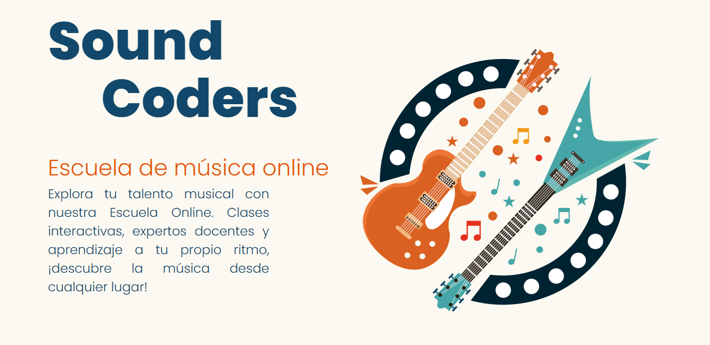
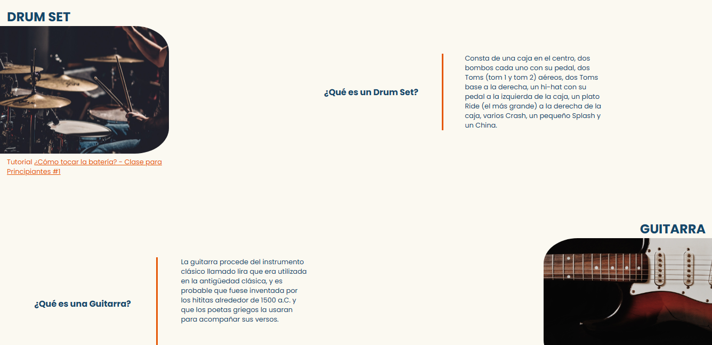
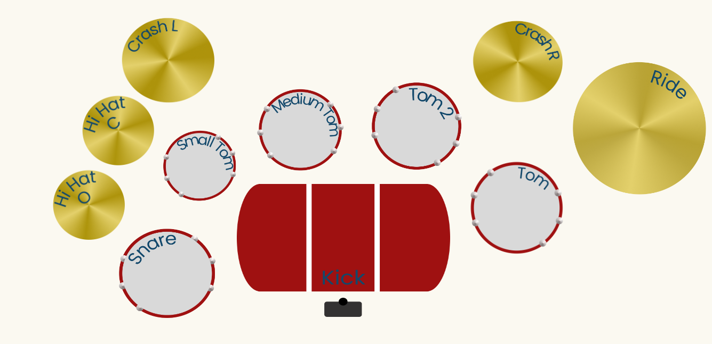
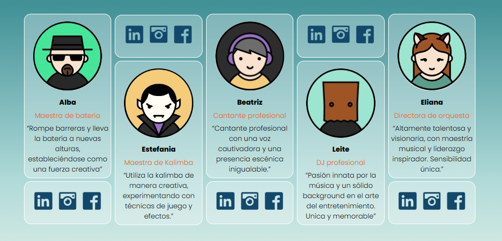
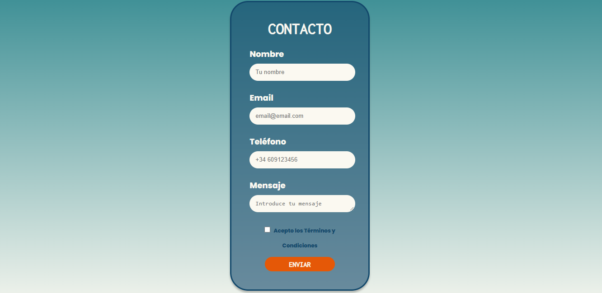
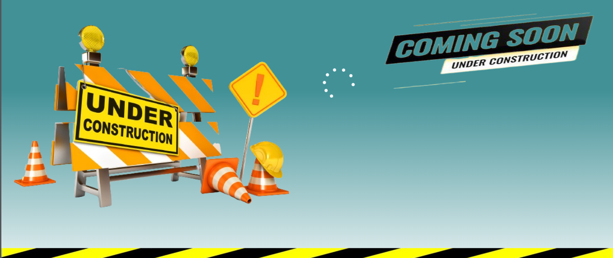
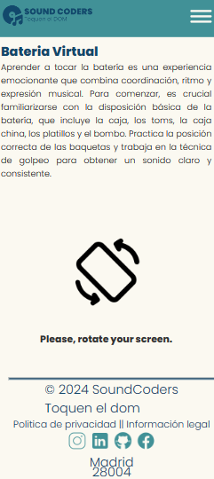
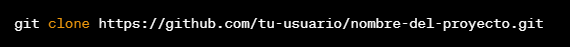
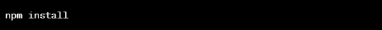

# ToquenElDom

### Descripción

Un proyecto de página web front-end diseñado para una escuela de musica. Cuenta con un instrumento interactivo: La bateria. Puede tocarse con ratón, teclado y movil, cuenta con animaciones en el instrumento y la web es completamente responsive.

## Secciones de la página

#### ToquenElDom - Home

#### ToquenElDom - Instruments

#### ToquenElDom - Interactive_instrument

#### ToquenElDom - About_Us

#### ToquenElDom - Contact

#### ToquenElDom - In_construction

>En caso de usar el instrumento en móvil:

 La web pedira al usuario que rote la pantalla para acceder al instrumento interactivo como se muestra a continuacion:

## Instalación
SIgue los siguientes pasos en la terminal (Bash).

#### Clona el repositorio:

#### Instala las dependencias:

#### Inicia la web:

